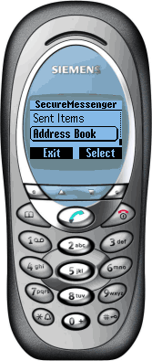

# SecureMessenger

## Foreword

This readme file describes the last version 1.1.1 of SecureSMS released in 2003. 

Most of the tools described here are no longer available or supported.

Comments in the files were left untouched before moving from SourceForge to Github.

## Introduction

As the name suggests, SecureMessenger allows secure peer-to-peer messaging between J2ME-enabled devices (mobile phones, PDAs etc.). Initial implementation uses SMS as transport and 3DES as cipher.

SecureMessenger consists of common API, three implementations of that API (for Siemens SL45i, Siemens M50/S55 and Nokia Series 60), common UI and a localization utility.

## Requirements

To build the SecureMessenger you will need:

 1 JDK 1.3.1 or higher (tested with JDK 1.4.1_05-b01)
 1 Siemens Mobility Toolkit (M50 or SL45i versions) to build Siemens 
 version of SecureMessenger
 1 Nokia Series 60 MIDP SDK for Symbian OS v 1.2.1 or higher to build Nokia 
 Series 60 version of SecureMessenger
 1 ANT 1.5.4
 1 Retroguard 1.1.13
   
## How to build

Download and unpack the zip file.

Tweak the build.xml
 1 Replace path to the retroguard.jar
 1 Replace path to the preverifiers/APIs of the Siemens/Nokia SDKs

Default target is ship-nokia-s60-en which builds English-language version of 
SecureMessenger to run on Nokia Series 60. Other available targets 
(at the time of writing) are: ship-nokia-s60-de, ship-siemens-m50-en, 
ship-siemens-m50-de, ship-siemens-sl45i-en, ship-siemens-sl45-en.

To build English-language version of Nokia Series 60 implementation of 
SecureMessenger at the command prompt:

```
ant
```

To build any other version of SecureMessenger at the command prompt:
```
ant {target}
```

## Localization

If you want to make SecureMessenger available in your 
language you need to translate the resources file and tweak
build.xml, so new resource file will be included into the
distribution jar.


## What's going to happen next?

In MIDP 2.0 it will be possible to wake up a midlet on arrival of a new 
message. I also hope that phone vendors will be able to provide some APIs 
for address book manipulation.

All this will allow SecureMessenger to be just a thin layer dealing with 
encryption/decryption and storing keys for addresses in the phones's address book.

## Known problems, To do

 1 THIS SOFTWARE HAS NOT BEEN TESTED ON REAL NOKIA SERIES 60.
 1 JAR file size declared in JAD may not match the actual JAR file size which 
 depends on compiler version that you use.
 1 User's manual is to be done.
 1 Encoding name is not currently included into the included into the resources 
 file, but it should be.
 1 Currently the keys should be typed in manually, No key exchange mechanism 
 implemented, but API is there (preferred mechanism of the key exchange is 
 via IR probably).

## Release history

### Version 0.9.0

Fixed bug # 596741 (Incorrect message address handling
while creating new message)

### Version 1.0.0

Implemented message alerts. Every time you receive a 
new message the "You've got message!" alert is shown.

Improved handling of phone numbers entered in international 
format (Siemens SL45i and Siemens M50 have some problems handling 
connections where international phone numbers entered with 
leading "+" character).

Improved handling of IO exceptions while sending messages. 
If user doesn't allow the MIDLet to send a message the 
SecureMessenger brings user back to the "New Message" form instead 
of Main Menu.

### Version 1.0.1

Added German resources file and targets to build German 
version of the SecureMessenger. 

Added new option for the resource converter, so it's possible to use
device-specific encodings while preparing resources.bin file as 
part of the build process. 

Note, that the ResourceLocator class still expects to find the resources 
in UTF-8 encoding. If a device doesn't support UTF-8, the
UnsupportedEncodingException is thrown and default device encoding
(the one you should use while encoding resources during the build)
is used instead of UTF-8.

### Version 1.1.0

Added support for Nokia Series 60. 

Fixed various typos in Javadoc and bugs in build.xml. 

### Version 1.1.1

Fixed message sending bug and descriptor/manifest file mismatch in 
Nokia Series 60 version.

## Acknowledgments

I'd like to say thank you to IvAnChO for help in testing the first version 
of SecureMessenger on Siemens SL45i, to Vitaly Osipov for the valuable 
advice on encryption and security and to Martin for translation of 
SecureMessenger resource file to German.

## Contacts

If you have any questions regarding SecureMessenger email me at emorozov@gmail.com

## Screenshots

Complete set of screenshots is in the `screenshots` directory. The image below is of SecureMessneger home sreen on Siemens M50.


